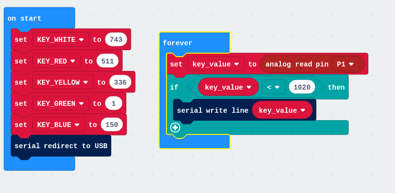
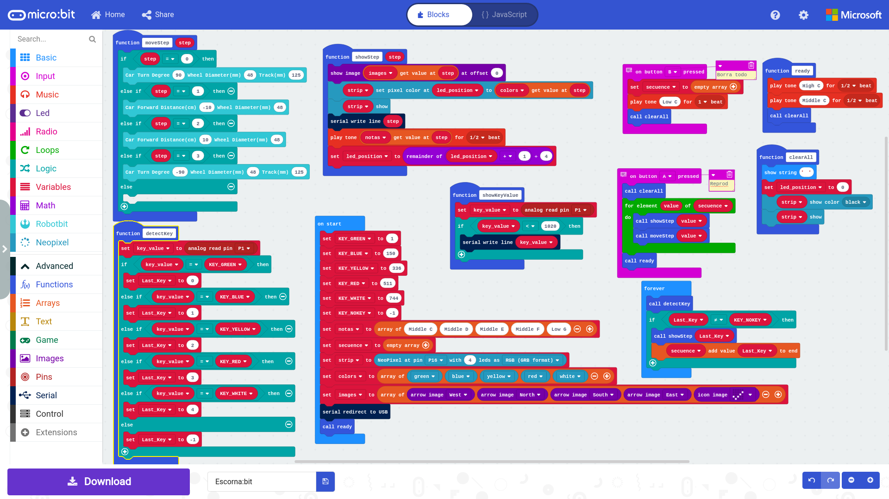
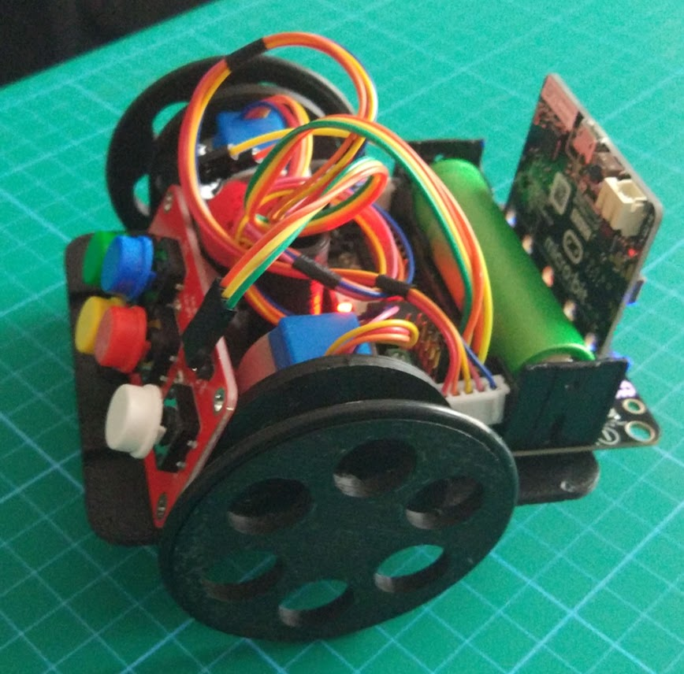

# AD Key

[Ejemplo para leer los valres](https://makecode.microbit.org/_TyDiCdWYV4g6)

[Grabador/reproductor de pulsaciones (1/2 simon)](https://makecode.microbit.org/_ggiX0Y9Pg025)

[Escorna:bit](makecode.microbit.org/_HCjRR92dFXXz)

Usa [Robot:bit](https://www.kittenbot.cc/products/robotbit-robotics-expansion-board-for-micro-bit)

