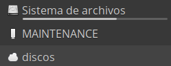

# Actualización del firmware

Nuestra micro:bit tiene un firmware para funcionar del modo al que estamos acostumbrados

Podemos ver su valor abriendo el fichero 

Ponemos la micro:bit en modo matenimiento, conectando el usb (sin alimentar con baterias/pilas) con el botón de reset pulsado ([Detalle de cómo hacerlo](https://microbit.org/guide/firmware/))

