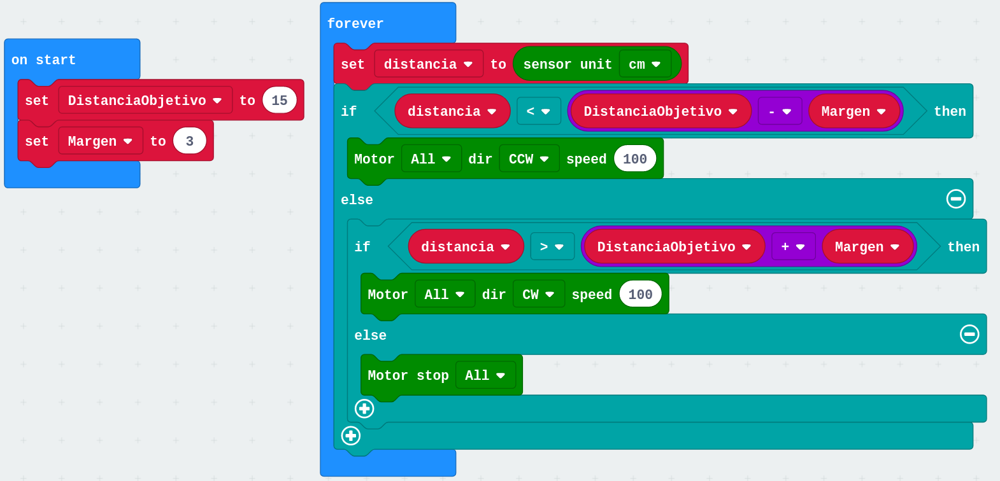

# Control

La teoría de control nos permite hacer que un sistema automático mantenga determinado valor de una magnitud. 

La estructura de estos programas es cíclica y suele tener esta estructura:
* Medida de la magnitud
* Comparamos con el valor de referencia y decimos
* Actuamos

Ejemplos son:
* Un termostato
* Un sistema de riego
* Un interruptor crepuscular (A veces intenta mantener el valor pero no es posible...)

## Ejemplo: Sistema que mantiene la distancia fija a un obstáculo

Vamos a usar un robot móvil que usando un sensor de ultrasonidos mide la distancia a un obstáculo que se puede mover, e intenta mantener la distancia al objeto fija

### Version 1

Vamos a implementar un programa tal y como hemos dicho:

Tenemos una distanciaObjetivo (15cm en el ejemplo)
* Medimos la distancia
* Decidimos: 
    * Si la distancia es mayor nos acercamos 
    * Si es menor nos alejamos
    * Si la distancia es igual nos quedamos parados

[Programa v1](https://makecode.microbit.org/_2oddVg9KhbC7)

En el [vídeo](https://youtu.be/B8Eli8WV7_M) vemos que se produce un comportamiento oscilatorio.

## Versión 2: Margen en los puntos de actuación - Histéresis

Para solucionarlo vamos a establecer un margen en la medida, por encima y por debajo del cual consideramos que el sistema está estabilizado

[Programa V2](https://makecode.microbit.org/_bmWbUaMA3Tdz)

En el [vídeo](https://youtu.be/aJpDed_MlTU) vemos como ahora el comportamiento es el esperado

## Versión 3: respuesta proporcional al error

Hacemos que la velocidad de los movimientos sea proporcional a la diferencia con la distancia que queremos conseguir

[Programa V3](https://makecode.microbit.org/_AHtKMk8DUDcx)

En el [vídeo](https://youtu.be/ce6OpFJk3P8) vemos el comportamiento

