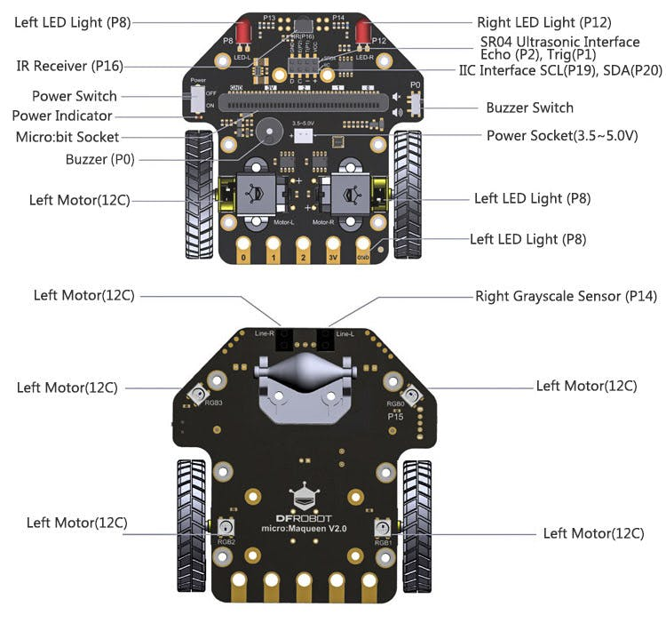

Robot MaQueen

[Documentación dfrobot](https://wiki.dfrobot.com/micro:Maqueen_for_micro:bit_SKU:ROB0148-E(ROB0148))

### Programación con blooques

Añadimos la extensión https://github.com/DFRobot/pxt-maqueen

### Ejemplos

#### 4 x Leds RGB

Añadimos la extensión de NeoPixels

[Ejemplo sencillo](https://makecode.microbit.org/_FXpHRk6m28pb)
Seleccionamos el P15 que es al que están conectados los 4 neopixels

 
#### Receptor de infrarrojos

Lee los datos y se quedan con los últimos dígitos

Con este sencillo programa podemos ver los códigos de las distintas teclas de los mandos

https://makecode.microbit.org/_Dm7961WkhHP6

        screen /dev/ttyACM0 115200

#### Motores
 
Podemos controlar los movimientos del robot usando los dos motores

Movimientos random https://makecode.microbit.org/_EkmXK2DV3Edq

 

[Movimientos básicos](https://makecode.microbit.org/_8mva3TEVH0rM)

[Sonidos y leds delanteros](https://makecode.microbit.org/_XrVhsU9tuH5x)

[Me muevo cuando hay luz](https://makecode.microbit.org/#editor)

[Ciclos de color RGB](https://makecode.microbit.org/_6hh2pqT959hh)

[Muestra la distancia](https://makecode.microbit.org/_AKAVHXVqkJM3)

[Huyo de los obstaculos](https://makecode.microbit.org/_C888wYRmrFAf)

[Siguelineas](https://makecode.microbit.org/_ApcYWLC3z7ok)

### Programando con Arduino

https://www.instructables.com/id/Using-the-DF-Robot-Micro-Maqueen-MicroBit-Robot-Pl/

### Recursos 

https://juegosrobotica.es/podcast-036/
