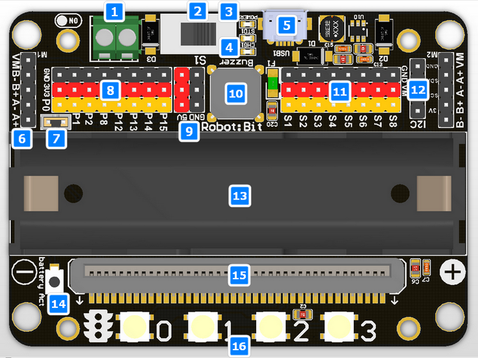

# Robot:bit

[Robot:bit](https://www.banggood.com/Robotbit-PlugPlay-5V-Multi-functional-Extension-Board-For-DIY-Programming-p-1234506.html)

[Extensión de makecode](https://github.com/KittenBot/pxt-robotbit)

Designed for robotic projects over microbit
* On board battery source
* Drive 8x servos and 4x DC motors and the same time (with 3.7v battery source to VM)
* Drive 2x Micro Stepper Motors
* On board buzzer
* On board 4x RGB Neo Pixels

[Detalles](https://www.kittenbot.cc/collections/frontpage/products/robotbit-robotics-expansion-board-for-micro-bit)

1. 5V external power input（with anti-reverse protection）
1. Power switch
1. Power Indicator
1. Battery Indicator
1. Micro USB charing port
1. 4-channel DC motor / 2-channel stepper motor
1. Jumper for buzzer selection
1. 8 channel IO（corresponding to Micro:bit P0-P2、P8、P12-P15）
1. 5V and GND port
1. Buzzer
1. 8 channel servo port
1. I2C interface (expandable I2C module)
1. 18650 battery case
1. Bettery protection recovery push button
1. Micro:bit edge connector
1. 4x RGB pixel

17. Servo driver (PCA9685)
18. 2xDc/Stepper driver (DRV8833)
19. KittenBot robot chassis mounting hole
20. Standard LEGO hole

[Documentacion](https://kittenbot.readthedocs.io/zh_CN/latest/mainboards/Robotbitv2.0.html)
