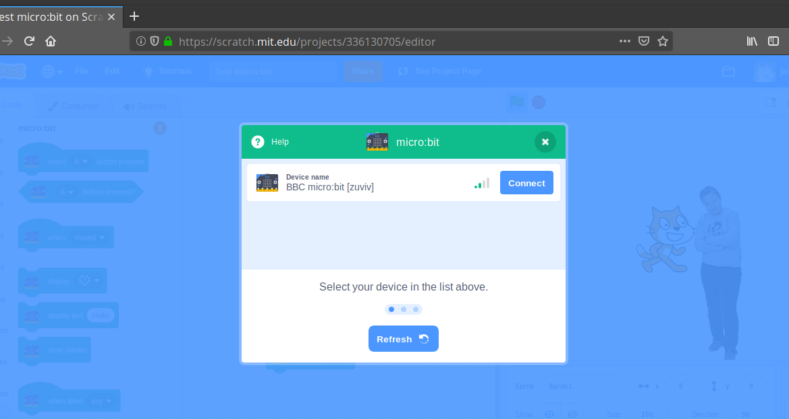
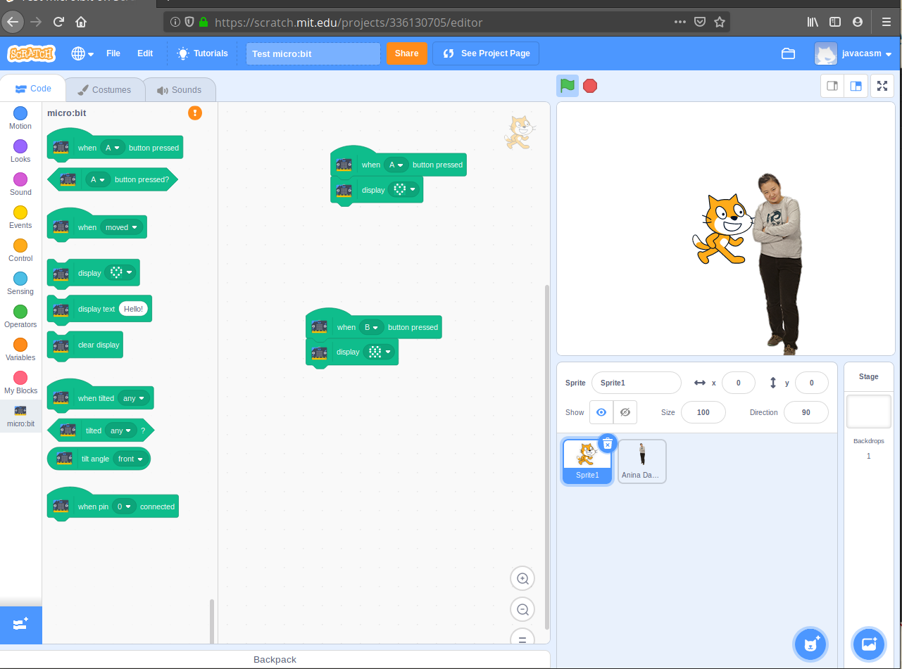

# Scratch 3 y micro:bit

Utilizar una micro:bit de una manera inalámbrica con scratch nos abre un mundo enorme de posibilidades de interación 

En windows y MacOs sólo tenemos que instalar [Scratch-Link](https://scratch.mit.edu/microbit)

Veamos como hacerlo para Linux siguendo el hilo https://scratch.mit.edu/discuss/topic/315200/ 

Para utilizaremos la [versión openSource que ha creado el usuario kawasaki](https://github.com/kawasaki/bluepy-scratch-link)

Instalamos la herramientas de bluetooth bluez y preparamos el entorno de compilación con

        sudo apt install bluez
        
        sudo apt install libgtk2.0-dev
        
        sudo pip3 install bluepy websockets
         
Descargamos el código del repositorio con

        git clone git@github.com:kawasaki/bluepy-scratch-link.git
        

y desde dentro del repositorio generamos un certificado PEM (La conexión con Scratch se hace encriptada con SSL)

        $ cd ./bluepy-scratch-link
        $ openssl req -x509 -out scratch-device-manager.cer \
        -keyout scratch-device-manager.key -newkey rsa:2048 -nodes -sha256 \
        -subj '/CN=scratch-device-manager' -extensions EXT -config <( \
        printf "[dn]\nCN=localhost\n[req]\ndistinguished_name = dn\n[EXT]\nsubjectAltName=DNS:localhost\nkeyUsage=digitalSignature\nextendedKeyUsage=serverAuth")
        $ openssl pkcs12 -inkey scratch-device-manager.key \
          -in scratch-device-manager.cer \
          -name "Scratch Link & Scratch Device Manager" \
          -passout pass:Scratch -export -out scratch-device-manager.pfx
        $ grep -h ^ scratch-device-manager.cer scratch-device-manager.key \
          | tr -d '\r' > scratch-device-manager.pem
          
Instalamos el [firmware de Scratch-link](https://downloads.scratch.mit.edu/microbit/scratch-microbit-1.1.0.hex.zip) en la micro:bit

Obtenemos un código de identificación de la micro:bit (zuviv) en mi caso, que nos permitirá identificar las diferentes micro:bits que tengamos.

Nos conectamos desde firefox a https://device-manager.scratch.mit.edu:20110/ y aceptamos su certificado, pulsando en "Avanzado" y "Acepto los riegos y quiero continuar.". Esto ocurre porque Scratch utiliza cerfiticados autofirmados.

Abrimos [Scratch 3.0](https://scratch.mit.edu) en firefox  y añadimos la extensión de micro:bit

Conectamos con nuestra micro:bit (la conexión se hace por bluetooth)

Podemos trabajar con nuestra micro:bit
