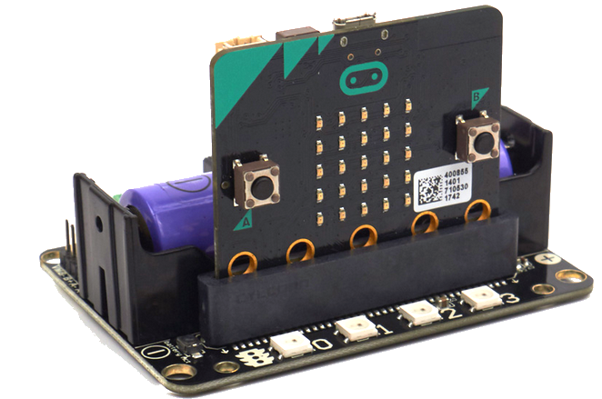
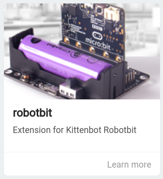

# Robot:bit

Cargamos la extensión robotbit de Kittenbot

## Test de motores rc

[Test motores M1A/M1B](https://makecode.microbit.org/_7MD1DxemdTaw)

<iframe style="position:absolute;top:0;left:0;width:100%;height:100%;" src="https://makecode.microbit.org/---codeembed#pub:_7MD1DxemdTaw" allowfullscreen="allowfullscreen" frameborder="0" sandbox="allow-scripts allow-same-origin"></iframe>

## Test de Geek servo

[Test 2 x Geek Servo](https://makecode.microbit.org/_acMT0fLeuRuP)

<iframe style="position:absolute;top:0;left:0;width:100%;height:100%;" src="https://makecode.microbit.org/---codeembed#pub:_acMT0fLeuRuP" allowfullscreen="allowfullscreen" frameborder="0" sandbox="allow-scripts allow-same-origin"></iframe>

[Review](https://www.youtube.com/watch?v=80RS95HBOYs)

## Pinout

Hardware interface
1. 5V external power input（with anti-reverse protection）
1. Power switch
1. Power Indicator
1. Battery Indicator
1. Micro USB charing port
1. 4-channel DC motor / 2-channel stepper motor
1. Jumper for buzzer selection
1. 8 channel IO（corresponding to Micro:bit P0-P2、P8、P12-P15）
1. 5V and GND port
1. Buzzer
1. 8 channel servo port
1. I2C interface (expandable I2C module)
1. 18650 battery case
1. Battery protection recovery push button
1. Micro:bit edge connector
1. 4x RGB pixel
1. Servo driver (PCA9685)
1. 2xDc/Stepper driver (DRV8833)
1. KittenBot robot chassis mounting hole
1. Standard LEGO hole

[Documentación](https://www.kittenbot.cc/products/robotbit-robotics-expansion-board-for-micro-bit)